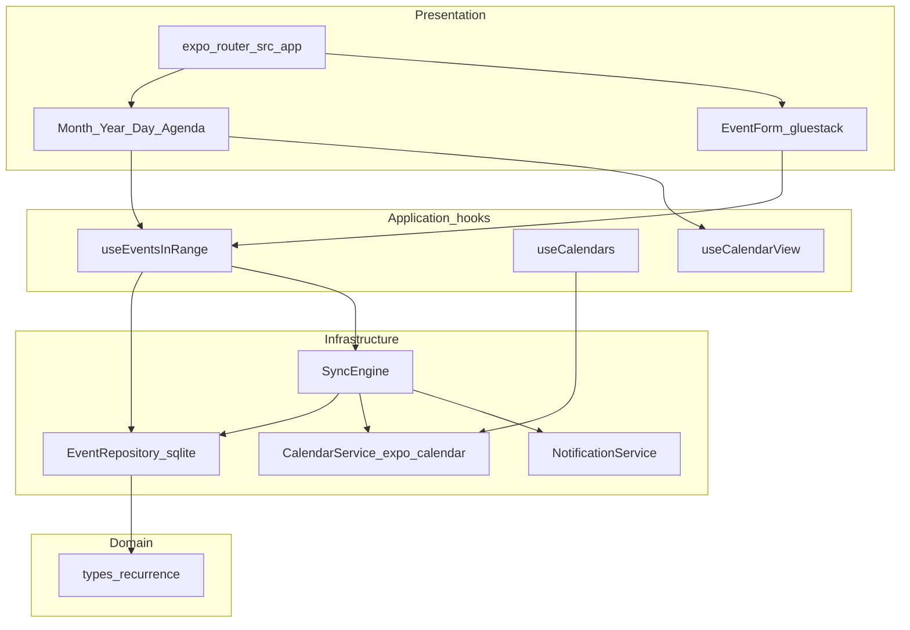

# Architecture

**Objectif.** Décrire les couches de l’application, les flux principaux et l’arborescence `src/` cible. Complète [SPECS.md](SPECS.md). Décisions : [adr/](adr/README.md).

## Couches



1. **Presentation** — écrans Expo Router + composants gluestack / vues calendrier custom  
2. **Hooks** — orchestration UI, pas de SQL direct dans les vues  
3. **Domain** — types, expansion récurrence, validation URL  
4. **Infrastructure** — SQLite, expo-calendar, expo-notifications  

## Structure `src/` cible

```
src/
  app/                 # routes uniquement (kebab-case)
  components/
    calendar/          # MonthView, YearView, DayView, AgendaView
    event/             # EventForm, EventDetail
    calendars/         # CalendarList
  db/                  # client, schema, migrations
  domain/              # types.ts, recurrence.ts, url.ts
  services/            # eventRepository, calendarDevice, syncEngine, notificationService
  hooks/
  i18n/locales/{en,fr}/
  constants/           # tokens si besoin — alignés gluestack, pas de 2e design system
```

Ne pas co-localiser composants dans `app/` (skill `expo-router`).

## Flux CRUD événement (app)

1. `EventForm` (RHF) → `EventRepository.create/update`  
2. `SyncEngine.pushEvent` → device si permissions + calendrier writable  
3. `NotificationService.syncForEvent`  
4. UI rafraîchit via `useEventsInRange`

## Flux pull device

1. `SyncEngine.pull(range)` liste événements device visibles  
2. Upsert miroir SQLite + `sync_map`  
3. LWW selon [SYNC.md](SYNC.md)  
4. Reschedule notifs si dates changent

## Providers racine (`_layout.tsx`)

`GluestackUIProvider` → i18n → DB ready → Navigation stack/groupes.

## Liens ADR

- Dev client : ADR-0001  
- SQLite SoT : ADR-0002  
- Sync device : ADR-0003  
- gluestack : ADR-0004  
