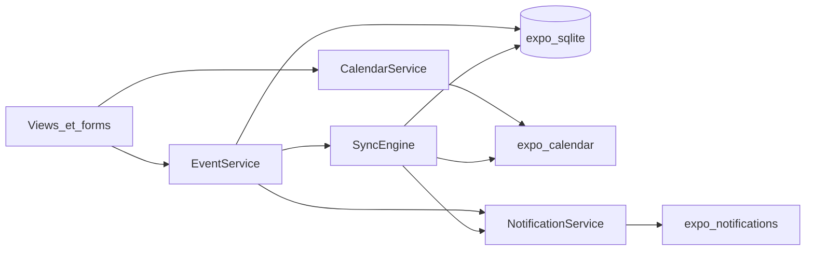

# Spécification Ok-Calendar

**Objectif.** Contrat produit et technique pour implémenter Ok-Calendar (Expo 57). Ton impératif. Pas d’alternatives ouvertes — les décisions sont figées (voir aussi [adr/](adr/README.md)).

## Table des matières

1. [Objectif produit](#1-objectif-produit)
2. [Stack technique](#2-stack-technique)
3. [Architecture données & sync](#3-architecture-données--sync)
4. [Modèle de domaine](#4-modèle-de-domaine)
5. [Notifications locales](#5-notifications-locales)
6. [Navigation & écrans](#6-navigation--écrans)
7. [Services & fichiers](#7-services--fichiers)
8. [Limites](#8-limites)
9. [Critères d’acceptation](#9-critères-dacceptation)
10. [Ordre d’implémentation](#10-ordre-dimplémentation)
11. [E2E Playwright](#11-e2e-playwright)
12. [i18n](#12-i18n)
13. [Skills & rules agents](#13-skills--rules-agents)

Détails : [ARCHITECTURE.md](ARCHITECTURE.md), [DATA_MODEL.md](DATA_MODEL.md), [SYNC.md](SYNC.md), [UI.md](UI.md), [TESTING.md](TESTING.md), [I18N.md](I18N.md).

---

## 1. Objectif produit

Application calendrier style Google Calendar :

- Vues **Mois / Année / Jour / Planning**
- Lister, activer/désactiver et CRUD les **calendriers device** si `allowsModifications`
- CRUD **événements** (champs §4)
- Afficher événements **locaux + device** fusionnés
- **Notifications locales** selon rappels

**Hors scope v1 :** OAuth Google/Outlook directs, invitations/participants, pièces jointes, multi-fuseaux avancés, édition « cette occurrence seulement ».

Plateformes : **iOS + Android**. Calendrier device non disponible sur web (adapter mock + E2E web).

---

## 2. Stack technique

| Rôle | Choix |
|------|--------|
| Framework | Expo 57 + `expo-router` |
| Native | `expo-dev-client` |
| Calendrier OS | `expo-calendar` (API classes) |
| Store | `expo-sqlite` + migrations |
| Notifs | `expo-notifications` + `alarms` expo-calendar |
| Dates | `date-fns` |
| État | Context + hooks (pas Redux v1) |
| UI | **gluestack-ui v5** + NativeWind |
| Formulaires | **React Hook Form** (`EventForm`) |
| i18n | i18next + react-i18next + expo-localization — **`en` défaut+fallback**, `fr` |
| Unit | Vitest + RTL |
| E2E | Playwright (Expo web) |

Plugins `app.json` : `expo-router`, `expo-calendar` (**full** read/write, jamais write-only), `expo-notifications`, `expo-sqlite`, splash, NativeWind selon doc gluestack.

Permissions iOS : calendrier full access + notifications. Android : `READ_CALENDAR`, `WRITE_CALENDAR`, `POST_NOTIFICATIONS`.

Règles UI : voir [UI.md](UI.md).

---

## 3. Architecture données & sync



- Événements **créés dans l’app** : SQLite = source de vérité ; device = réplique.
- Événements **importés device** : device = source ; SQLite = miroir (`origin = device`).
- Calendriers `allowsModifications === false` : affichage + toggle visibilité seulement.

SyncEngine : après CRUD, `AppState` active, pull-to-refresh, intervalle foreground ~60s. Fenêtre pull : `[now-12mois, now+24mois]`. Conflits **LWW** (`updatedAt` vs `lastModifiedDate`) ; à égalité device gagne si `origin=device`, local si `origin=app`. Échec device → `syncStatus=pending|error`, retry. Soft-delete puis purge après sync OK.

Permissions calendrier **complètes** ; refus → mode **local-only**.

Détail : [SYNC.md](SYNC.md), ADR-0002, ADR-0003.

---

## 4. Modèle de domaine

### Calendar

`id`, `deviceCalendarId?`, `title`, `color`, `source` (`local`|`device`), `allowsModifications`, `isVisible`, `isPrimary`, `syncEnabled`.

Créer au premier lancement le calendrier local « OK Calendar » ; lier un calendrier device homonyme si possible.

### Event (CRUD)

| Champ | Règles |
|-------|--------|
| `title` | requis, trim, max 200 |
| `allDay` | bool |
| `startAt` / `endAt` | ISO ; `endAt > startAt` |
| `recurrence` | `none` \| `daily` \| `weekly` \| `monthly` \| `yearly` |
| `description` | max 5000 |
| `location` | optionnel |
| `url` | optionnel ; si présent valider `http`/`https`/`mailto` |
| `notifications` | 0..N rappels |
| `calendarId` | FK writable |

Métadonnées : `origin`, `deviceEventId`, `syncStatus`, `updatedAt`, `deletedAt`.

Récurrence → `RecurrenceRule` interval 1, sans `endDate` v1. Édition/suppression = **série entière**.

### Rappel

`type`: `at_event` | `minutes_before` | `hours_before` | `days_before` ; `value` > 0 sauf `at_event`.

DDL et types : [DATA_MODEL.md](DATA_MODEL.md).

---

## 5. Notifications locales

`NotificationService` : permission ; schedule sur occurrences (fenêtre 90 jours) ; id stable `notif:{eventId}:{reminderId}:{occurrenceStart}` ; reschedule sur CRUD/sync. Alarms OS si écriture device OK. Tap → `okcalendar://event/{localEventId}`.

Détail : [NOTIFICATIONS.md](NOTIFICATIONS.md).

---

## 6. Navigation & écrans

```
src/app/
  _layout.tsx
  index.tsx                 # redirect → /(calendar)
  (calendar)/_layout.tsx
  (calendar)/index.tsx
  event/[id].tsx
  event/new.tsx
  event/edit/[id].tsx
  calendars/index.tsx
  settings/index.tsx
```

Vues : Month (grille 6×7), Year (12 mini-mois), Day (timeline + all-day), Planning (agenda groupé). FAB « + », Aujourd’hui, switcher de vue, Toast sync, AlertDialog delete.

Composants hors `app/` : `components/calendar/*`, `components/event/*`, etc.

---

## 7. Services & fichiers

```
src/db/  src/domain/  src/services/  src/hooks/  src/components/  src/i18n/
```

Contrats :

- `EventRepository.create | update | delete | getById | listInRange`
- `CalendarService.listDevice | create | update | delete | requestPermissions`
- `SyncEngine.pull | pushEvent | pushAllPending`
- `NotificationService.syncForEvent | cancelForEvent | resyncWindow`

Sur web : `CalendarService` = **adapter mock**.

---

## 8. Limites

- Update/delete série complète seulement (API class expo-calendar)
- Tester calendrier/notifs sur **device réel**
- Calendriers abonnés / birthdays : read-only
- IDs device peuvent changer → recreate + remap
- Web : pas de calendrier OS réel

---

## 9. Critères d’acceptation

1. 4 vues + navigation période + Aujourd’hui
2. CRUD événement + validation §4
3. Récurrence visible sur les 4 vues
4. Rappels → notifs locales (permission OK)
5. Liste calendriers ; toggle ; CRUD si writable
6. Création → SQLite + device ; edit/delete répliqués ; pull externes
7. Mode local-only si permission refusée
8. Deep link notif → détail
9. Dev client iOS/Android démarre ; `expo-doctor` OK
10. UI gluestack cohérente
11. Docs OSS présentes
12. Scénarios E2E documentés ; suite Playwright verte à l’implémentation
13. Catalogues `en`+`fr` ; défaut/fallback `en`
14. AGENTS.md skills+rules ; React Hook Form ; URLs validées

---

## 10. Ordre d’implémentation

1. gluestack + i18n (`en`/`fr`) + providers  
2. Dev client + plugins + SQLite migrations  
3. Domain + EventRepository + EventForm + testID  
4. 4 vues + navigation  
5. Playwright + `views.navigation`  
6. NotificationService  
7. CalendarService + mock web + écran calendriers  
8. SyncEngine  
9. Settings langue  
10. E2E restants + CI  
11. Polish, deep links, tests manuels device  
12. MAJ README/ROADMAP si divergence  

---

## 11. E2E Playwright

Voir [TESTING.md](TESTING.md) et [ADR-0008](adr/0008-playwright-e2e.md).

Scénarios minimaux : `views.navigation`, `event.create-edit-delete`, `event.validation`, `event.recurrence-display`, `calendars.local-only`, `i18n.switch-locale`.

---

## 12. i18n

Voir [I18N.md](I18N.md) et [ADR-0009](adr/0009-i18n-fr-en.md).

**`en` = défaut et fallback** ; **`fr` = locale complète**. Contenu utilisateur (titre, etc.) non traduit.

---

## 13. Skills & rules agents

Voir [AGENTS.md](../AGENTS.md) et [DEVELOPMENT.md](DEVELOPMENT.md).

Obligatoire : `.agents/skills/` (expo-overview en premier) + `.cursor/rules/react/`.
